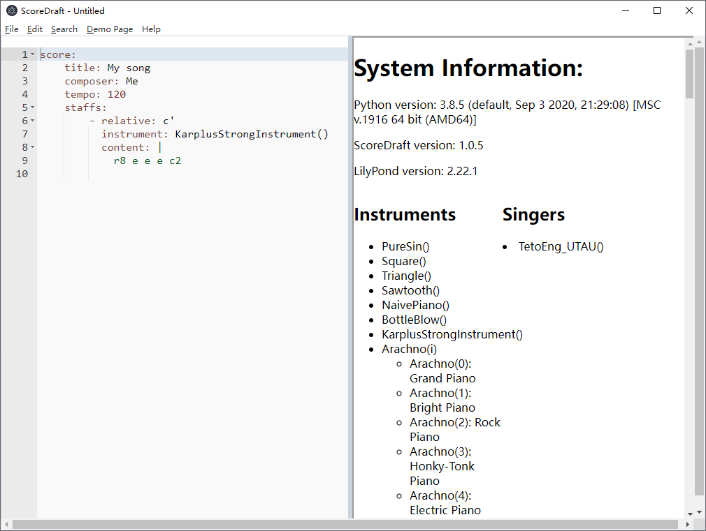
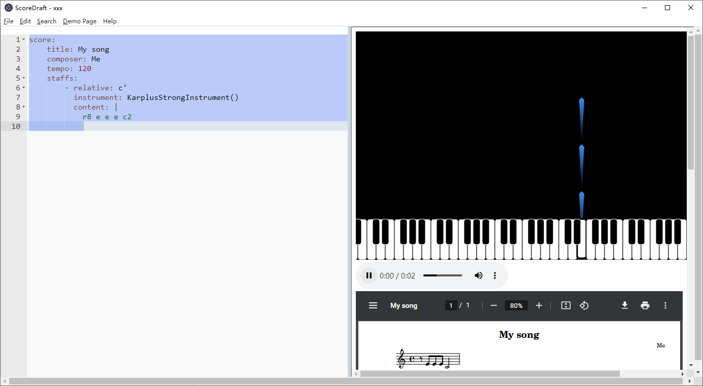

[-> 中文用户指南](README_cn.md)

# ScoreDraft Editor User Guide

Please follow the [Install Instructions](https://github.com/fynv/ScoreDraftEditor#get-all-the-components) first to get the components installed.

Then start the editor, you should see this window:

## Install Instruments & Singer

Click **Help-System Information**:

Here you should see the versions of the underlying components, and the instruments/singers that are available to use. Since that you have not installed any sound-fonts or UTAU voicebanks, here you only have the built-in instruments, which you can put down to the "instrument" field. 

To populate the list, you can download SF2 files and put them into the **SF2** directory, or download UTAU voicebanks and extract to **UTAUVoice** directory. For example, I downloaded the **Arachno SoundFont** from http://www.arachnosoft.com/main/soundfont.php, extracted and renamed the SF2 file to **Arachno.sf2**, which I put into the **SF2** directory. Then I downloaded **kasaneteto** voicebank from https://kasaneteto.jp/en/voicebank.html, which I extracted and renamed to **TetoEng**, which I put into the **UTAUVoice** directory. Now what I see in the **System Information** page looks like:

Now the instruments **Arachno(0), Arachno(1)..** and the singer **TetoEng_UTAU()** can be used your YAML code.

## YAML Based Score Input

The YAML based input format is specific to ScoreDraft, which contains everything from the outline information of the score, to the options to be passed to the synthesizer, to the note lines (expressed using LilyPond's syntax). For detail information please see:

* [YAML Based Input](https://fynv.github.io/ScoreDraft/intro_eng.html#yaml-based-input) in the ScoreDraft introduction.

* [LilyPond Learning Manual: LilyPond &mdash; Learning Manual](https://lilypond.org/doc/v2.22/Documentation/learning/index.html)

## Score Previews

Score previews are only available after you saved the YAML file. 

By default, it shows only the sheet music on the right side, which is updated after every save.

To generate the demo-page containing a music player and the Meteor visualizer, press F5 or click **Demo Page - Build**.

You can also check **Demo Page - Auto Build** so that the demo-page is re-generated after each save.

The generated demo page files are located at the same directory of the YAML file, which can be opened using any browser. To share it, the following file should be included:

* A html file

* A pdf file

* A wav file

* meteor_static.js

