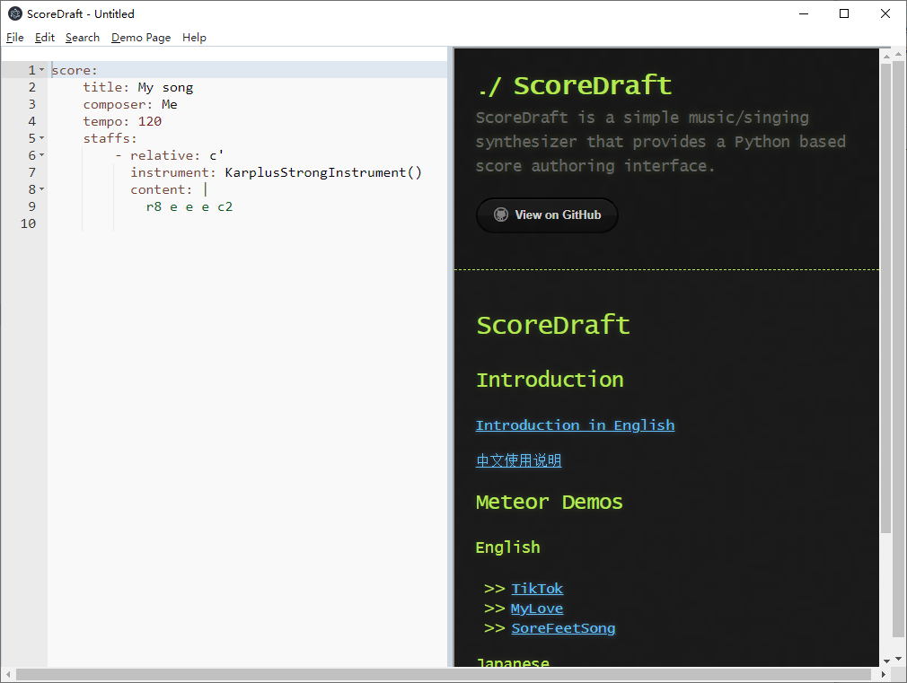
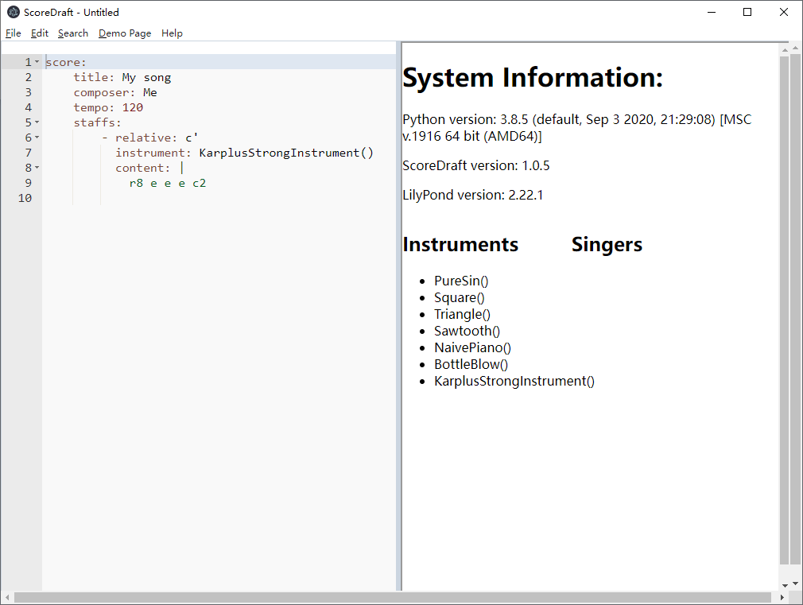
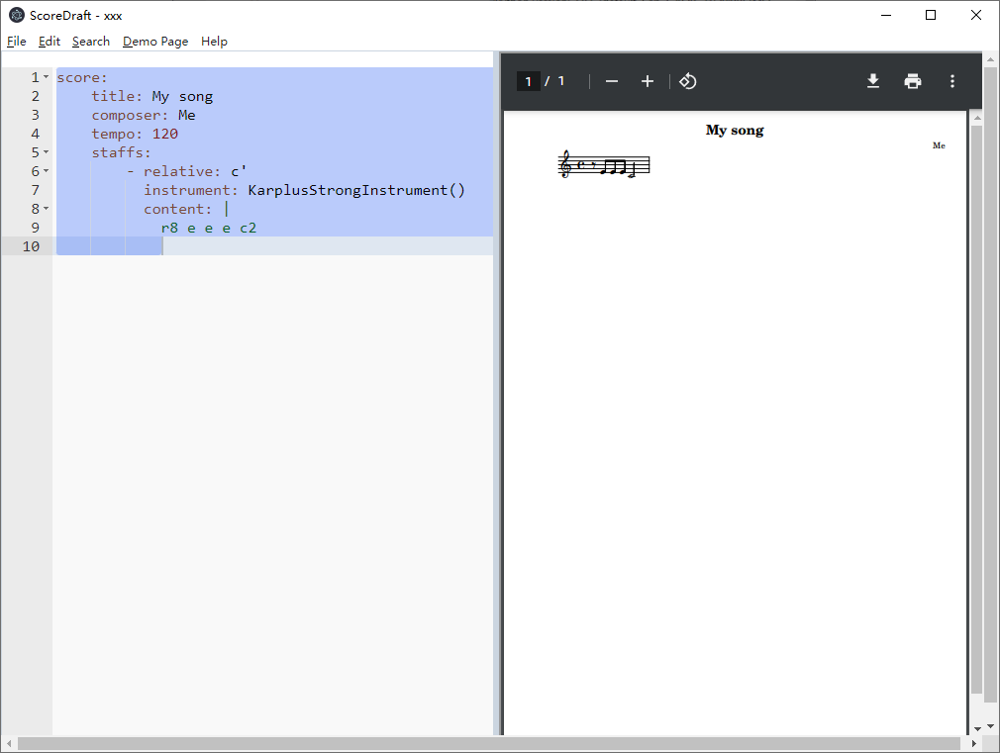
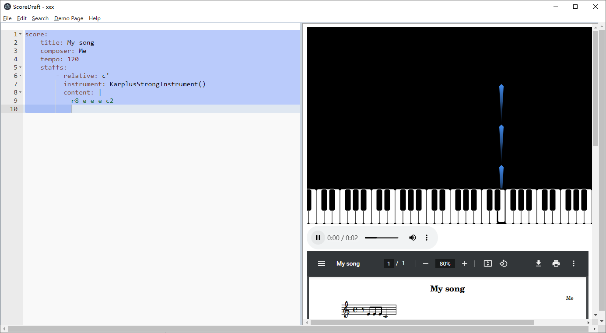

# ScoreDraft 编辑器用户指南

首先请参考[安装说明](https://github.com/fynv/ScoreDraftEditor/blob/master/README_cn.md)，安装编辑器的各个组件。

安装完毕后启动编辑器，你会看到：

## 音源安装

点击 Help-System Information:

这里你看到的是各个组件的版本号，以及可以使用的乐器和歌手列表。由于你还没有安装任何的sound-font 和 UTAU 音源，这里只有内置乐器可以使用（代码中“instrument: ”后）。

要增加乐器和歌手，你可以下载SF2文件，把它放到SF2目录下面，或者下载UTAU音源，解压到UTAUVoice下面。例如，我从 http://www.arachnosoft.com/main/soundfont.php 下载了音源，解压出SF2文件，重命名为 Arachno.sf2，放在SF2目录下。然后我从 https://kasaneteto.jp/en/voicebank.html 下载了重音Teto音源，解压并重命名为TetoEng，放在UTAUVoice目录下，此时我在系统信息页上看到的是：

此时，新的乐器 Arachno(0), Arachno(1)... 以及歌手 TetoEng_UTAU() 就都可以用在YAML代码中了。

## 基于YAML的乐谱输入

这里这种基于YAML的输入格式是ScoreDraft专用的，包含了曲谱的全部信息，从曲谱框架信息，到合成器选项，到用 LilyPond 语法编写的每行音符。详细信息请参考：

- ScoreDraft 介绍中的 [基于 YAML 格式的输入](https://fynv.github.io/ScoreDraft/intro_cn.html#%E5%9F%BA%E4%BA%8E-yaml-%E6%A0%BC%E5%BC%8F%E7%9A%84%E8%BE%93%E5%85%A5) 

- [LilyPond Learning Manual: LilyPond — Learning Manual](https://lilypond.org/doc/v2.22/Documentation/learning/index.html)

## 乐谱预览

只有当你保存YAML文件后才会看到乐谱预览。

默认地，在右侧，仅仅显示乐谱，每次保存时刷新。

如果想生成包含音频播放器和Meteor可视化的演示页，只需要按F5或者点击 Demo Page - Build。

你也可以勾选 Demo Page - Auto Build，这样每次保存时会重新生成演示页。

生成的演示页文件在YAML文件同目录下，可以用普通浏览器打开。分享时需要包含一个html文件，一个pdf文件，一个wav文件，以及 meteor_static.js。

